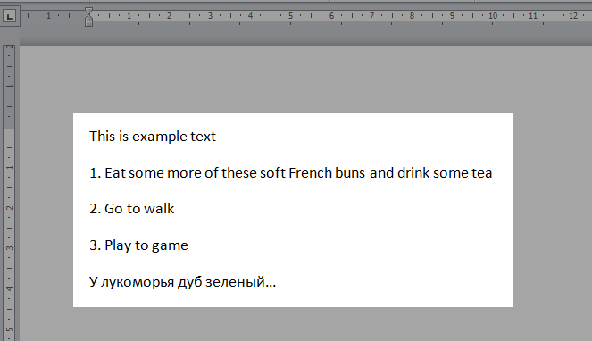

# ScreenToTextApp

Application for getting text on screen image, by using image recognition

### Features

- Recognizing text on screen. Support language `English`, `Russian`

### Running
Only on visual studio. Running in other place require IronOcr license.
Before debugging recommended set (the application is on top of all windows, there may be difficulties with closing)
```csharp
WindowState = FormWindowState.Normal
```

### Example

Part of the screen image



Recognized text:

```
 This is example text

 1. Eat some more of these soft French buns and drink some tea
 
 2. Go to walk
 3. Play to game
 
 У лукоморья дуб зеленый...
```

##### Used Libraries

[IronOCR]

[IronOCR]: <http://gulpjs.com>